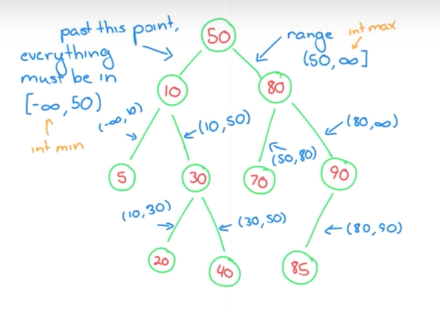

# Editorial

## Trees: Is This a Binary Search Tree?

### Definition
A tree is said to be **a binary search tree** if it is satisfying the following conditions.

- The value of every node in a node's left subtree is less than the data value of that node.s
- The value of every node in a node's right subtree is greater than the data value of that node.

### Solution



The point is, the condition each node has to satisfy is just what interval it is in and can be calculated with updating the minimum and maximum values on the interval.

- Check if the node is in the interval
- When you go left
 - update the max
- When you go right
 - update the min

```python3
MIN = 0
MAX = 10**4

def check_subtree(root, min_val, max_val):
    if root is None:
        return True
    elif root.data > min_val and root.data < max_val:
        return check_subtree(root.left, min_val, root.data) and check_subtree(root.right, root.data, max_val)
    else:
        return False

def check_binary_search_tree_(root):
    return check_subtree(root, MIN, MAX)
```
